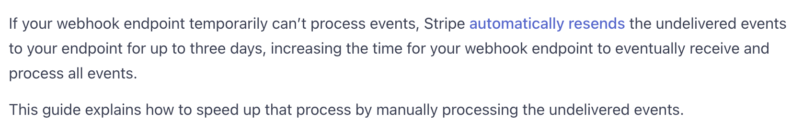
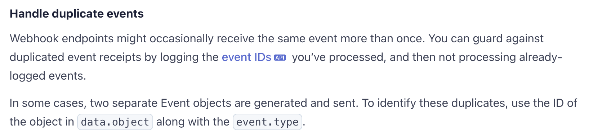
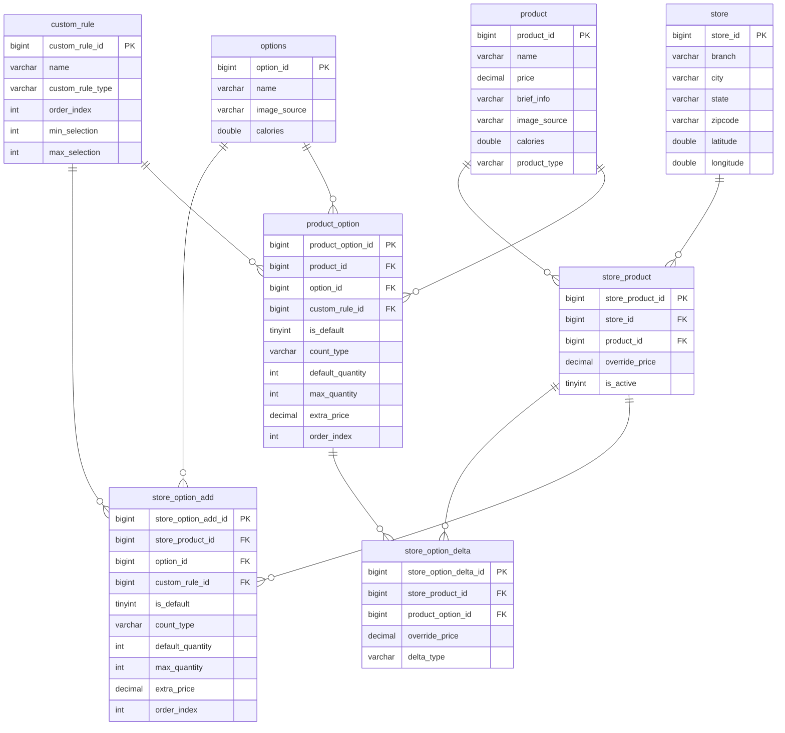

# Whattheburger (Fast Food Order System)

<!-- <p align="center">
  <b><a href="#korean">🇰🇷 한국어 (KOR)</a></b> | <b><a href="#english">🇺🇸 English (ENG)</a></b>
</p> -->

## 목차
- [프로젝트 소개](#1-프로젝트-소개)
- [핵심 설계](#2-핵심-설계-의사결정)
- [상세 문서](#3-상세-문서)

# 1. 프로젝트 소개

### 패스트푸드 주문 시스템: Whattheburger (왓더버거)
#### 역할
- 풀스택 개발자
#### 규모
- 개인 프로젝트
#### 설명
실제 패스트푸드 주문 서비스를 모델로 한 풀스택 프로젝트입니다. 사용자와 비즈니스 관점에서 바라보며 요구사항을 정의하고 시스템을 설계했으며, Spring Boot와 React 환경에서 구현했습니다. 재고 차감 설계, 결제 장애 대응, 프랜차이즈 데이터 구조 설계, 프론트엔드/백엔드 계산 책임 분리 등 서비스 특성에 따른 설계 의사결정을 통해 시스템 품질 요소를 고려한 시스템을 구축하였습니다.

### Repository

- GitHub
    - 백엔드 저장소
        - [https://github.com/wndyd0131/whattheburger_backend](https://github.com/wndyd0131/whattheburger_backend)
    - 프론트엔드 저장소
        - [https://github.com/wndyd0131/whattheburger_frontend](https://github.com/wndyd0131/whattheburger_frontend)

### 주요 기능

- 프랜차이즈 매장 검색 및 선택
- 상품 커스터마이징 (옵션, 수량 등)
- Redis 기반 장바구니
- 주문 스냅샷 생성
- Stripe 결제
- Webhook 기반 주문 생성
- WebSocket 기반 실시간 주문 상태 조회
- 주문 내역 조회

### **기술 스택**

#### **백엔드**

- Spring Boot
- Spring Security
- JPA / Hibernate
- Redis
- MySQL

#### **프론트엔드**

- React

#### **인프라**

- AWS EC2
- Nginx
- Docker

#### **외부 서비스**

- Stripe
- Mapbox

#### **테스트**

- JUnit5
- AssertJ
- Testcontainers
- MockMvc
- Mockito

#### **성능 측정 및 모니터링**

- K6
- Spring Actuator

#### **기타**

- WebSocket
- Python

### 스크린샷


---

# 2. 핵심 설계 의사결정
## 1. 재고 차감
### **문제**

사용자가 주문을 확정하면, 주문한 상품과 선택한 옵션에 필요한 재료 재고가 주문 수량만큼 차감됩니다. 서비스의 특성에 따라 "차감 흐름"과 "동시성 로직 제어"에 대해 의사결정을 내렸습니다.

<details>
<summary>상세</summary>

### **재고 차감 시점**

| 재고 차감 시점 | 장점 | 단점 |
| :--- | :--- | :--- |
| **장바구니 담기 / 주문 시작 시점** | • 결제 전 재고 확보 가능<br>• 사용자의 주문 가능 여부 보장 | • 재고 장기 점유 가능성<br>• 예약 만료/복구 로직 필요<br>• 수정 시 재고 재계산 필요<br>• 동시성 처리 및 상태 관리 복잡 |
| **주문 확정 시점** | • 재고 점유 없음<br>• 빠른 재고 회전율 유지<br>• 낮은 재고 관리 복잡성 | • 결제 직전 품절 가능성<br>• 결제 후 취소 및 환불 처리 필요 |

#### **선택**
- 주문 확정 시점 차감

#### **이유**

패스트푸드 도메인에서는 옵션 재고 부족 가능성이 비교적 낮고, 상품/옵션
수정이 자주 발생합니다.

따라서 재고 예약 방식은 재고 차감 외에도 수정, 삭제, 만료 시점마다 재고
상태를 관리해야 하므로 구현 복잡도가 크게 증가합니다.

반면 주문 확정 시점 차감은 재고 홀딩 로직을 줄이고, 빠른 재고 회전율을
유지할 수 있습니다.

### **재고 차감 동시성 처리**

#### **선택**

- 비관적 락

#### **이유**

결제 흐름에서의 병목을 확인하던 중, 기존의 반복 원자적 업데이트 방식의 비효율을 확인했습니다. 사용자에게 주문 실패에 대한 피드백을 제공하기 위해서는, 원자적 업데이트 사용 시에는 반복문을 통해 쿼리를 여러번 날려야 합니다.
이러한 문제는 DB에 여러번 접근을 하게 되어 요청이 많아질수록 문제가 될 수 있다고 여겼습니다.

그래서, 재고를 잠금에 따라 로직을 수행하는 비관적 락과 비교하면서 어떤 방식이 더 확장성과 성능 측면에서 더 효율적인지 측정하였고, 그 결과 비관적 락을 적용해 결제 흐름을 최적화 했습니다.

#### **검증**

여러 재고를 동시에 차감해야 하는 환경에서 RPS를 기반으로 실험한 결과, 비관적 락이 2배 많은 요청량에서 2배 빠른 응답속도를 보이는 것을 확인했습니다.

1. **원자적 업데이트 - 주문 당 재고 10**
   
2. **비관적 락 - 주문 당 재고 10**
   

# 🔗 링크

[https://app.notion.com/p/06dc0bf300058383969b815cc8f257b3?source=copy_link](https://app.notion.com/p/06dc0bf300058383969b815cc8f257b3?pvs=21)

</details>

---

## 2. 결제 Webhook 멱등성 처리

### **문제**
Stripe Webhook 요청 처리 중 서버에 장애가 발생하더라도 안전하게 결제를 처리할 수 있도록 설계했습니다.

<details>
<summary>상세</summary>



*그림. Stripe Webhook 중복 처리 문서*

Stripe Webhook은 서버로부터 정상적인 응답을 받지 못하면 동일한 이벤트를 재전송할 수 있습니다. 따라서 동일한 결제 완료 이벤트가 여러 번 전달되더라도 **주문 생성 및 재고 차감이 중복으로 수행되지 않도록 멱등성을 보장**해야 합니다.

단순히 동일한 요청을 차단하는 것만으로는 충분하지 않았습니다. 서버의 지연이나 장애로 인해 이전 요청이 일부만 처리된 상태에서 재요청이 발생할 수 있기 때문입니다.

특히 다음과 같은 실패 상황을 고려했습니다.

| **실패 시점** | **상태**                  | **재요청 시 필요한 처리** |
| --- |-------------------------|------------------|
| 주문 생성 전 장애 | 주문 데이터 없음               | 결제 처리 전체 로직 재실행  |
| 주문 생성 후 장애 | 주문 데이터는 존재, 후처리 작업은 미완료 | 주문 생성 외 로직만 재실행  |
| 모든 처리 완료 후 응답 실패 | 모든 작업 완료                | 중복 작업 방지 후 정상 응답 |

### **멱등성 보장**

#### **선택**

`checkout_session_id`에 대한 **Unique 제약 조건을 통해 주문 생성을 멱등하게 처리**

#### **이유**

처음에는 Redis에 멱등성 키의 처리 상태를 저장하여 중복 요청을 차단하는 방식을 고려했습니다.

하지만 서버 장애가 발생하면 Redis의 `Processing` 상태와 실제 DB 트랜잭션의 성공 여부가 불일치할 수 있습니다. TTL을 통해 복구할 수도 있지만, TTL 이전에는 정상적인 재처리가 제한되고 TTL 이후에는 이전 요청이 여전히 실행 중일 가능성을 추가로 고려해야 했습니다.

반면 결제마다 Stripe의 고유한 `checkout_session_id`가 존재하기 때문에, 이를 주문 데이터의 Unique 제약 조건으로 관리하면 **DB가 최종적으로 보장해야 하는 "하나의 결제에 하나의 주문"이라는 불변식을 직접 보장**할 수 있습니다.

따라서 별도의 멱등성 상태를 관리하기보다 DB의 Unique 제약 조건을 최종 방어선으로 사용했습니다.

### **부분 실패에 대한 재처리**
```java
@Transactional
public Order completePaidOrder(
        OrderSession orderSession,
        String checkoutSessionId,
        PaymentMethod paymentMethodObject
) {
    Order order = buildOrderFromSession(orderSession);
    order.updateOrderStatus(OrderStatus.CONFIRMING);
    order.changePaymentStatus(PaymentStatus.PAID);
    applyCardInfo(order, paymentMethodObject);
    order.changeCheckoutSessionId(checkoutSessionId);
    inventoryService.deductStock(order);
    return saveOrder(order);
}
```
```java
Order order;
if (idempotencyKeyExists == false) {
    order = orderService.completePaidOrder(
            orderSession,
            session.getId(),
            paymentMethodObject
    );
} else {
    order = orderService.loadOrderByCheckoutSessionId(session.getId())
            .orElseGet(() ->
                    orderService.completePaidOrder(
                            orderSession,
                            session.getId(),
                            paymentMethodObject
                    )
            );
}

orderTrackingService.scheduleOrder(orderSession, order);
cartService.cleanUp(UUID.fromString(cartSessionId));
orderService.addOrderToOrderSession(order, orderSession);
```

주문 생성과 재고 차감은 `completePaidOrder()`의 하나의 트랜잭션으로 처리하지만, 주문 상태 스케줄링, 장바구니 정리, 주문 세션 업데이트 등의 후처리는 트랜잭션 외부에서 수행합니다.

모든 후처리를 하나의 DB 트랜잭션에 포함하면 트랜잭션과 DB 커넥션 점유 시간이 길어지고, 향후 후처리를 비동기 작업으로 확장하기도 어려워진다고 판단했습니다.

따라서 재요청이 발생하면 **주문 데이터의 존재 여부를 기준으로 이전 요청의 처리 지점을 판단**하도록 설계했습니다.

#### **처리 흐름**

<details>
  <summary>멱등성 처리 플로우 차트</summary>

  ```mermaid
flowchart TD
    start([Stripe webhook POST]) --> receive["CheckoutController<br/>webhook 수신"]
    receive --> verifySig{Signature 검증}
    verifySig -->|실패| bad400[400 Bad Request]
    verifySig -->|성공| deserialize[Session deserialize]
    deserialize --> handle["CheckoutService<br/>handleCheckoutSessionCompleted"]
    handle --> buildKey["멱등성 키 생성<br/>eventType:sessionId"]
    buildKey --> tryAcquire{"Redis SET NX<br/>TTL 5분"}

    tryAcquire -->|최초 획득| firstPath["completePaidOrder<br/>신규 Order 생성"]
    tryAcquire -->|키 이미 존재| dupPath[loadOrderByCheckoutSessionId]

    dupPath --> orderExists{Order 존재?}
    orderExists -->|Yes| commonPost
    orderExists -->|No race fallback| fallback["completePaidOrder<br/>fallback"]

    firstPath --> commonPost["scheduleOrder<br/>+ cart cleanUp<br/>+ addOrderToOrderSession"]
    fallback --> saveResult{saveOrder 결과}
    saveResult -->|성공| commonPost
    saveResult -->|checkoutSessionId unique violation| rollback["@Transactional rollback<br/>재고 차감 포함"]
    rollback --> err500[500 Internal Server Error]
    err500 --> stripeRetry[Stripe 재전송]
    stripeRetry --> dupPath

    commonPost --> ok200([200 OK])

    subgraph redisLayer [Redis]
        buildKey
        tryAcquire
    end

    subgraph dbLayer [DB]
        saveResult
        rollback
    end
```
</details>


1. **주문이 존재하지 않는 경우**
    - 주문 생성 및 재고 차감 수행
    - 후처리 수행
2. **주문이 이미 존재하는 경우**
    - 주문 생성 및 재고 차감 생략
    - 누락 가능성이 있는 후처리만 재실행
3. **후처리 작업**
    - 재실행될 수 있으므로 각 작업 역시 중복 실행에 안전하도록 처리

이를 통해 동일한 Webhook이 반복해서 전달되더라도 **주문과 재고의 정합성을 유지하면서, 장애로 인해 누락된 후처리는 복구할 수 있도록 설계했습니다.**

### **지연된 중복 요청 처리**

이전 Webhook 요청이 아직 처리 중인 상황에서 동일한 요청이 다시 들어올 수도 있습니다.

최초 요청이 성공하면 생성된 주문을 기준으로 중복 생성을 방지할 수 있고, 실패하면 이후 Stripe의 재요청을 통해 다시 처리할 수 있습니다. 최종적으로 Unique 제약 조건이 동시에 들어온 요청에 대해서도 중복 주문 생성을 방지합니다.

### **결과**

Webhook의 중복 요청을 단순 차단하는 방식에서 벗어나 **서버 장애와 부분 실패를 고려하여 재처리 가능한 결제 흐름**을 구성했습니다.

- 동일 결제에 대한 중복 주문 및 재고 차감 방지
- 주문 생성 전 장애 발생 시 전체 결제 처리 재시도
- 주문 생성 후 장애 발생 시 누락된 후처리 복구
- DB Unique 제약 조건을 통한 최종 데이터 정합성 보장

</details>

---

## 3. 프랜차이즈 상품 데이터 구조

### 문제

프랜차이즈 매장의 공통 상품 정보는 재사용하면서 매장별 다른 구성을 지원하도록 설계했습니다.

<details>
<summary>상세</summary>

### 후보 비교

| 방식 | 장점 | 단점 |
| :--- | :--- | :--- |
| **단일 카탈로그 참조** | • 구조 단순<br>• 데이터 중복 없음<br>• 본사 상품 변경 즉시 반영 | • 매장별 상품 추가, 가격 변경, 판매 숨김 처리 어려움 |
| **매장별 전체 카탈로그 복제** | • 매장별 독립 구성 가능<br>• 조회 로직 단순 | • 데이터 중복 큼<br>• 본사 상품 변경 시 전체 매장 동기화 필요<br>• 동기화 누락 시 불일치 발생 |
| **카탈로그 + 추가/변경 테이블** | • 데이터 중복 감소<br>• 매장별 독립 구성 가능<br>• 본사 상품 변경 즉시 반영 | • 조회 로직 복잡도 및 조회 비용 증가 |

### 선택

카탈로그 + 추가/변경 테이블 구조

### 이유

프랜차이즈 매장은 대부분 본사에서 승인한 공통 상품을 판매하지만, 일부
매장은 지역 한정 상품을 추가하거나 상품 가격과 판매 여부를 다르게 운영할
수 있습니다.

단일 카탈로그 참조 방식은 데이터 중복이 없지만 매장별 운영 차이를
반영하기 어렵고, 매장별 전체 카탈로그 복제 방식은 유연하지만 데이터
중복과 동기화 비용이 큽니다.

따라서 공통 상품 정보는 카탈로그 테이블에 저장하고, 매장별 추가 상품은
StoreAdd, 상품의 변경사항은 StoreDelta에 분리하여 저장했습니다. 이를
통해 데이터 중복을 줄이면서도 매장별 구성을 유연하게 변동할 수 있도록
설계했습니다.

### 트레이드오프

해당 방식은 조회 시 Catalog와 StoreAdd/StoreDelta를 병합해야 하므로 쿼리
및 서비스 로직이 복잡해지고 조회 비용이 증가합니다. 대신 공통 데이터의
중복 저장을 피하면서 매장별 운영 정책을 유연하게 반영할 수 있습니다.

# ERD
<details>
<summary>프랜차이즈 스키마 ERD</summary>


</details>

# 🔗 링크

[https://app.notion.com/p/386c0bf3000580ccabb5f5ac81440da8?source=copy_link](https://app.notion.com/p/386c0bf3000580ccabb5f5ac81440da8?pvs=21)

</details>

---

# 3. 상세 문서
- [시스템 아키텍처](docs/architecture.md)
- [도메인 설계](docs/domain_design.md)
- [요청 흐름](docs/sequence_diagrams.md)
