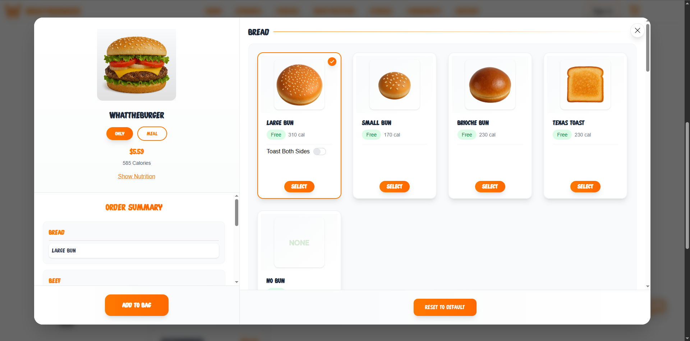
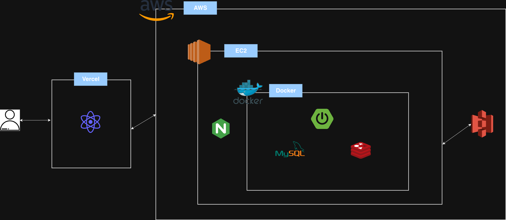
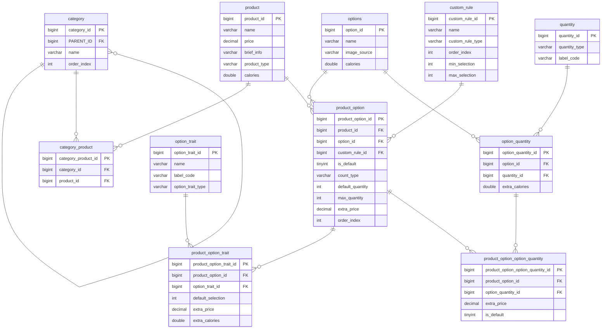
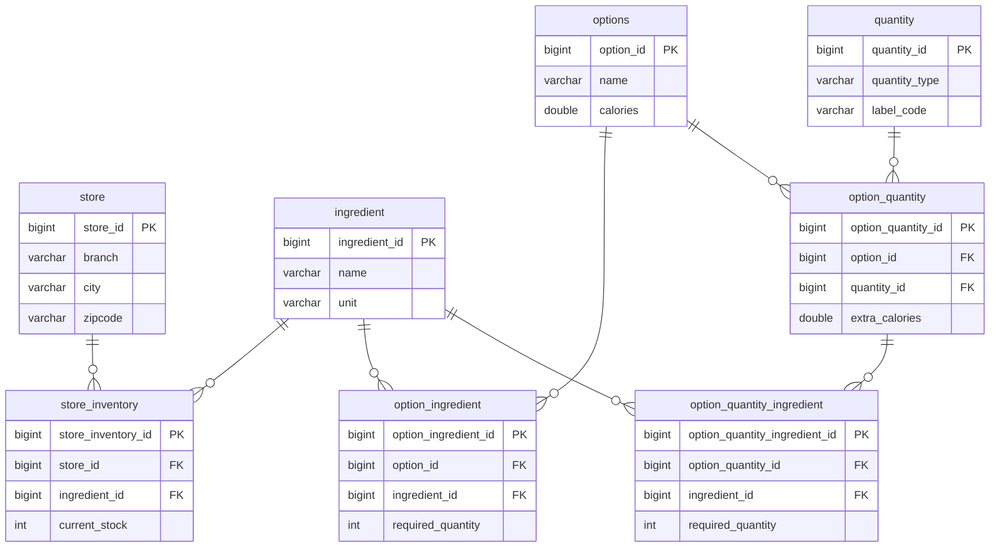
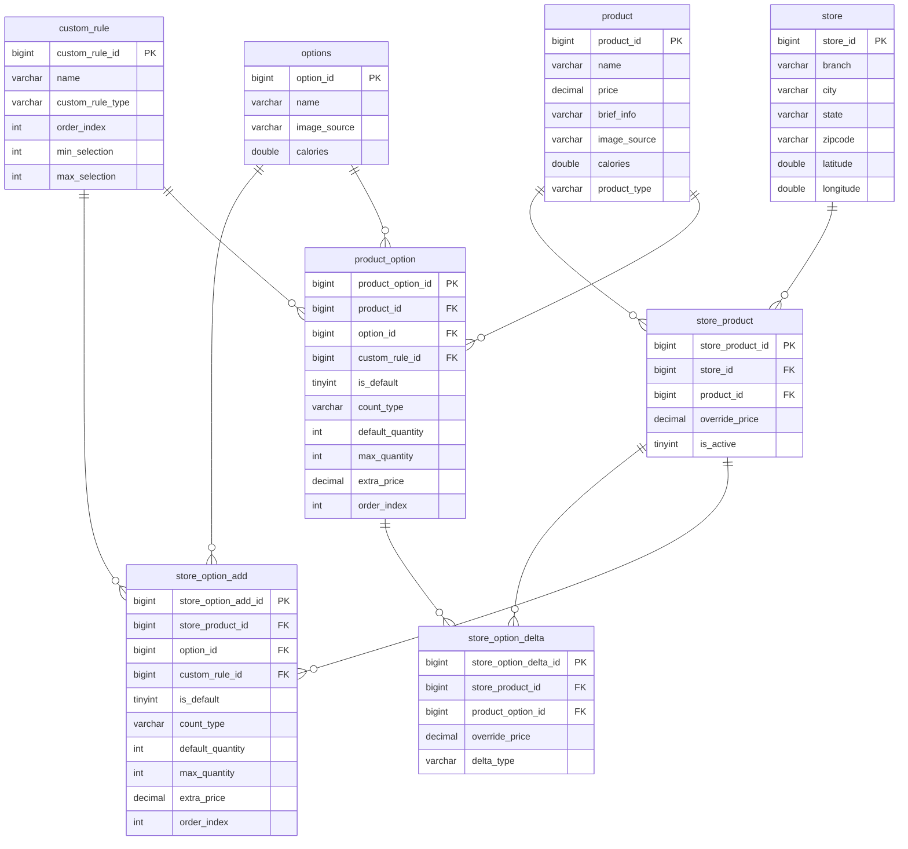

# Whattheburger (Fast Food Order System)

<!-- 

  <b><a href="#korean">🇰🇷 한국어 (KOR)</a></b> | <b><a href="#english">🇺🇸 English (ENG)</a></b>

 -->

# 1. 프로젝트 소개

### 패스트푸드 주문 시스템: Whattheburger (왓더버거)

실제 패스트푸드 주문 서비스를 모델링한 풀스택 프로젝트입니다. ERD와
시퀀스 다이어그램을 기반으로 시스템을 설계하고 Spring Boot와 React
환경에서 구현했습니다. 해당 시스템을 개발하면서 재고 차감 흐름, 장바구니
저장소, 프랜차이즈 매장 데이터 관리 구조 등 서비스 특성에 따른 설계
의사결정을 통해 성능, 데이터 정합성, 확장성을 함께 고려했습니다.

### Repository

- GitHub
    - 백엔드 저장소
        - [https://github.com/wndyd0131/whattheburger_backend](https://github.com/wndyd0131/whattheburger_backend)
    - 프론트엔드 저장소
        - [https://github.com/wndyd0131/whattheburger_frontend](https://github.com/wndyd0131/whattheburger_frontend)

### 주요 기능

- 프랜차이즈 매장 검색 및 선택
- 상품 커스터마이징 (옵션, 수량 등)
- Redis 기반 장바구니
- Stripe Checkout 결제
- Webhook 기반 주문 생성
- WebSocket 실시간 주문 상태 조회
- 주문 내역 조회

### 기술 스택

**백엔드**

- Spring Boot
- Spring Security
- JPA / Hibernate
- Redis
- MySQL

**프론트엔드**

- React

**인프라**

- AWS EC2
- Nginx
- Docker

**외부 서비스**

- Stripe
- Mapbox

**기타**

- WebSocket
- Python

### 스크린샷

---

# 2. 시스템 아키텍처

# 시스템 아키텍처 다이어그램

# 시퀀스 다이어그램

## 매장 불러오기
.png)

## 장바구니 담기
.png)

## 주문/결제
.png)

## 실시간 주문 상태 조회
.png)

---

# 3. 도메인 설계

# 카탈로그

## ERD

### 주요 엔티티

| 엔티티 | 역할 |
| --- | --- |
| `product` | 치즈버거, 불고기버거와 같은  상품 |
| `option` | 치즈, 양상추, 피클과 같은 선택 가능한 재료 |
| `trait` | 토스팅, 맵기 정도 등과 같은 상세 선택 |
| `quantity` | 정수가 아닌 수량 (Small, Medium, Large) |
| `customRule` | 최소/최대 선택 개수 등 선택 규칙 |

#### 1. 상품별 옵션 구성

하나의 상품은 특정 옵션과 상세 옵션만 선택할 수 있어야 합니다.

e.g. 빅맥에는 치즈와 피클 옵션이 존재하지만 아메리카노에는 존재하지
않습니다.

이를 위해 `product`, `option`, `trait`, `quantity`를 분리하고 조인
엔티티를 통해 상품별로 허용된 옵션을 정의했습니다. 이러한 구조를 통해
상품마다 다른 옵션 구성을 가질 수 있으며, 잘못된 옵션 선택을 방지할 수
있습니다.

#### 2. 옵션 선택 규칙

옵션에 대해서는 선택 방식에 대한 제약이 필요합니다.

e.g. 버거 주문 시 "빵" 분류에서는 일반 빵, 브리오슈 빵, 없음 중 하나만
선택할 수 있지만, "토핑" 분류에서는 여러 옵션을 동시에 선택할 수
있습니다.

이를 위해 `customRule` 엔티티를 도입하여 아래와 같은 사항을 관리하도록
설계하여 규칙을 데이터를 통해 관리할 수 있도록 설계했습니다.

- 옵션 그룹 분류
- 최소 선택 개수
- 최대 선택 개수
- 화면 표시 순서

# 상품 인벤토리

## ERD

### 주요 엔티티

| 엔티티 | 역할 |
| --- | --- |
| `store_inventory` | 매장별 재료 재고 |
| `ingredient` | 치즈, 패티, 빵 등 실제 차감 대상 재료 |
| `option` | 사용자가 선택하는 옵션 |
| `quantity` | 셀 수 없는 옵션에 대한 수량 선택 옵션 |
| `option_ingredient` | 셀 수 있는 옵션에 대한 재료량 |
| `option_quantity_ingredient` | 셀 수 없는 옵션에 대한 재료량 |

#### 재고 차감

패스트푸드는 상품의 재고를 옵션 단위로 관리합니다. 즉, 하나의 옵션이
여러 재료를 사용하는 관계입니다.

e.g. 치즈버거의 치즈 옵션은 "치즈"를 재고로 사용합니다.

따라서 재고는 `store_inventory`에서 매장별 `ingredient` 단위로 관리하고,
옵션 선택 시 셀 수 있는 수량에 대한 소모량은 `option_ingredient`, 셀 수
없는 수량에 대한 소모량은 `option_quantity_ingredient`로 분리하였습니다.

이를 통해 주문 시 선택된 옵션 조합을 기반으로 실제 차감해야 할 재료
재고를 계산할 수 있도록 설계하였습니다.

# 주문

### 주요 엔티티

| 엔티티 | 역할 |
| --- | --- |
| `orders` | 주문 기본 정보, 결제 상태, 주문 상태 |
| `order_product` | 주문한 상품의 스냅샷 |
| `order_custom_rule` | 주문 당시 옵션 그룹/선택 규칙 스냅샷 |
| `order_product_option` | 주문 당시 선택한 옵션 스냅샷 |
| `order_product_option_trait` | 주문 당시 선택한 상세 옵션 스냅샷 |

#### 주문 스냅샷

주문은 결제와 정산의 기준이 되므로, 상품 카탈로그 변경의 영향을 받으면
안 됩니다.

따라서 `orders`에 `store_product_id` 같은 참조값만 저장하지 않고, 조인
엔티티를 활용하여 주문 당시의 상품명, 가격, 옵션명, 선택값을 함께
저장하였습니다. 이를 통해 상품 정보가 변경되거나 숨김 처리되더라도 과거
주문 내역은 결제 당시 기준으로 안정적으로 조회할 수 있습니다.

## ERD

---

# 4. 핵심 설계 의사결정 - 재고 차감

### 문제

사용자가 주문을 확정하면, 주문한 상품과 선택한 옵션에 필요한 재료 재고가 주문 수량만큼 차감됩니다. 서비스의 특성에 따라 "차감 흐름"과 "동시성 로직 제어"에 대해 의사결정을 내렸습니다.

### 재고 차감 시점

| 재고 차감 시점 | 장점 | 단점 |
| :--- | :--- | :--- |
| **장바구니 담기 / 주문 시작 시점** | • 결제 전 재고 확보 가능 • 사용자의 주문 가능 여부 보장 | • 재고 장기 점유 가능성 • 예약 만료/복구 로직 필요 • 수정 시 재고 재계산 필요 • 동시성 처리 및 상태 관리 복잡 |
| **주문 확정 시점** | • 재고 점유 없음 • 빠른 재고 회전율 유지 • 낮은 재고 관리 복잡성 | • 결제 직전 품절 가능성 • 결제 후 취소 및 환불 처리 필요 |

#### 선택

일반 상품:

- 주문 확정 시점 차감

예외:

- 한정 수량 상품 → 재고 예약 고려

#### 이유

패스트푸드 도메인에서는 옵션 재고 부족 가능성이 비교적 낮고, 상품/옵션
수정이 자주 발생합니다.

따라서 재고 예약 방식은 재고 차감 외에도 수정, 삭제, 만료 시점마다 재고
상태를 관리해야 하므로 구현 복잡도가 크게 증가합니다.

반면 주문 확정 시점 차감은 재고 홀딩 로직을 줄이고, 빠른 재고 회전율을
유지할 수 있습니다.

#### 예외

단, 한정 수량 상품처럼 짧은 시간에 요청이 몰리는 경우에는 결제 후 취소가
대량으로 발생할 수 있고, 이는 사용자 경험 저하를 야기할 수 있습니다.

뿐만 아니라 주문 세션 관리, Stripe 결제 및 환불 처리 등 여러 작업을
부담하는 주문 시스템에 부하를 줄 수 있다는 문제가 있습니다.

이 경우에는 주문 시스템에서 먼저 요청을 제한할 수 있도록 **재고 예약
방식**이 더 적합하다고 판단했습니다.

### 재고 차감 동시성 처리

#### 선택
비관적 락

#### 이유

재고 부족으로 주문이 실패할 경우, 사용자는 어떤 옵션의 재고가 부족한지 확인할 수 있어야 합니다.

비관적 락을 통해 주문에 필요한 여러 재고를 하나의 트랜잭션에서 조회하고 잠근 뒤 검증하도록 설계했습니다. 이를 통해 재고의 음수 차감을 방지하면서, 재고 부족 발생 시 애플리케이션 로직에서 부족한 옵션을 확인하여 사용자에게 구체적인 실패 원인을 제공할 수 있습니다.

원자적 업데이트 방식도 재고의 음수 차감을 방지할 수 있지만, 여러 종류의 재고를 차감하면서 부족한 옵션을 확인하려면 재고별로 차감 쿼리를 반복적으로 실행해야 합니다.

주문량과 차감 대상 재고가 증가할수록 DB 요청 횟수가 증가하고, 하나의 요청이 커넥션을 점유하는 시간도 길어질 수 있습니다. 이는 커넥션 풀 부족과 응답 지연으로 이어질 수 있다고 판단했습니다.

따라서 여러 재고를 함께 검증하고 구체적인 실패 원인을 제공해야 하는 주문 흐름에서는 비관적 락이 더 적합하다고 판단했습니다.

# 🔗 링크

[https://app.notion.com/p/06dc0bf300058383969b815cc8f257b3?source=copy_link](https://app.notion.com/p/06dc0bf300058383969b815cc8f257b3?pvs=21)

---

# 5. **핵심 설계 의사결정 - 프랜차이즈 상품 데이터 구조**

### 문제

프랜차이즈 매장의 공통 상품 정보는 재사용하면서 매장별 다른 구성을 지원하도록 설계했습니다.

### 후보 비교

| 방식 | 장점 | 단점 |
| :--- | :--- | :--- |
| **단일 카탈로그 참조** | • 구조 단순 • 데이터 중복 없음 • 본사 상품 변경 즉시 반영 | • 매장별 상품 추가, 가격 변경, 판매 숨김 처리 어려움 |
| **매장별 전체 카탈로그 복제** | • 매장별 독립 구성 가능 • 조회 로직 단순 | • 데이터 중복 큼 • 본사 상품 변경 시 전체 매장 동기화 필요 • 동기화 누락 시 불일치 발생 |
| **카탈로그 + 추가/변경 테이블** | • 데이터 중복 감소 • 매장별 독립 구성 가능 • 본사 상품 변경 즉시 반영 | • 조회 로직 복잡도 및 조회 비용 증가 |

### 선택

카탈로그 + 추가/변경 테이블 구조

### 이유

프랜차이즈 매장은 대부분 본사에서 승인한 공통 상품을 판매하지만, 일부
매장은 지역 한정 상품을 추가하거나 상품 가격과 판매 여부를 다르게 운영할
수 있습니다.

단일 카탈로그 참조 방식은 데이터 중복이 없지만 매장별 운영 차이를
반영하기 어렵고, 매장별 전체 카탈로그 복제 방식은 유연하지만 데이터
중복과 동기화 비용이 큽니다.

따라서 공통 상품 정보는 카탈로그 테이블에 저장하고, 매장별 추가 상품은
StoreAdd, 상품의 변경사항은 StoreDelta에 분리하여 저장했습니다. 이를
통해 데이터 중복을 줄이면서도 매장별 구성을 유연하게 변동할 수 있도록
설계했습니다.

### 트레이드오프

해당 방식은 조회 시 Catalog와 StoreAdd/StoreDelta를 병합해야 하므로 쿼리
및 서비스 로직이 복잡해지고 조회 비용이 증가합니다. 대신 공통 데이터의
중복 저장을 피하면서 매장별 운영 정책을 유연하게 반영할 수 있습니다.

# ERD

# 🔗 링크

[https://app.notion.com/p/386c0bf3000580ccabb5f5ac81440da8?source=copy_link](https://app.notion.com/p/386c0bf3000580ccabb5f5ac81440da8?pvs=21)

---

# 6. 핵심 설계 의사결정 - 장바구니 저장소

### 문제

장바구니 데이터를 어디에 저장하고 어떻게 관리할 것인지 결정했습니다.

## 장바구니 스토리지

### 후보

| 후보 스토리지 | 장점 | 단점 |
| :--- | :--- | :--- |
| **RDBMS (DB)** | • 영속성 보장 및 데이터 정합성 • 복잡한 관계형 쿼리 • 트랜잭션 지원 | • 디스크 I/O 기반으로 빈번한 쓰기 작업 시 상대적으로 느린 응답 속도 |
| **Redis** | • 인메모리 기반으로 인한 Read/Write 성능 • TTL 기능으로 임시 데이터 자동 삭제 용이 • 분산 환경에서 공유 스토리지 활용 가능 | • 상품 정보를 함께 저장할 경우 최신성 관리 필요 • 메모리 기반 저장소이므로 영속성 보장이 상대적으로 약함 |
| **Local Memory** | • 네트워크 비용이 없어 가장 빠른 속도 | • 휘발성 • 수평 확장 시 데이터 동기화 불가 |

### 최종 선택

Redis

### 이유

장바구니는 주문 직전까지 상품과 옵션이 빈번하게 수정되는 데이터이며,
영구 보관 가치가 낮습니다. 따라서 복잡한 조회와 영속성을 갖는
데이터베이스보다 빠른 읽기/쓰기 성능과 TTL 기반 자동 만료를 제공하는
Redis가 더 적절하다고 판단했습니다.

## 장바구니 데이터 구조: 성능 vs 데이터 정합성

Redis를 활용할 때 발생할 수 있는 데이터 최신성 문제를 해결하기 위해
데이터 저장 범위를 최적화했습니다.

- **Redis 저장 데이터:** `productId`, `optionId`, `traitId`, `quantity` (사용자의 최소 선택 식별자 및 수량)
- **RDBMS 조회 데이터:** 상품명, 가격, 옵션 상세 정보, 재고 등

### 트레이드오프

상품명이나 가격까지 Redis에 통째로 캐싱하면 조회 성능은 극대화되지만,
관리자가 상품 가격을 변경했을 때 장바구니에 오래된 가격이 그대로 남는
데이터 정합성 문제가 발생합니다.

금전적 신뢰도가 중요한 커머스 특성을 고려하여, 식별자(id)와 사용자
\*\*\*\*선택 정보만 Redis에 가볍게 캐싱하고, 실제 상품 정보는 DB 조회를
통해 항시 최신 상태를 보장하도록 설계하여 성능과 정합성의 균형을
맞췄습니다.

# 🔗 링크

[https://app.notion.com/p/553c0bf300058392973881f055fab583?source=copy_link](https://app.notion.com/p/553c0bf300058392973881f055fab583?pvs=21)

---
