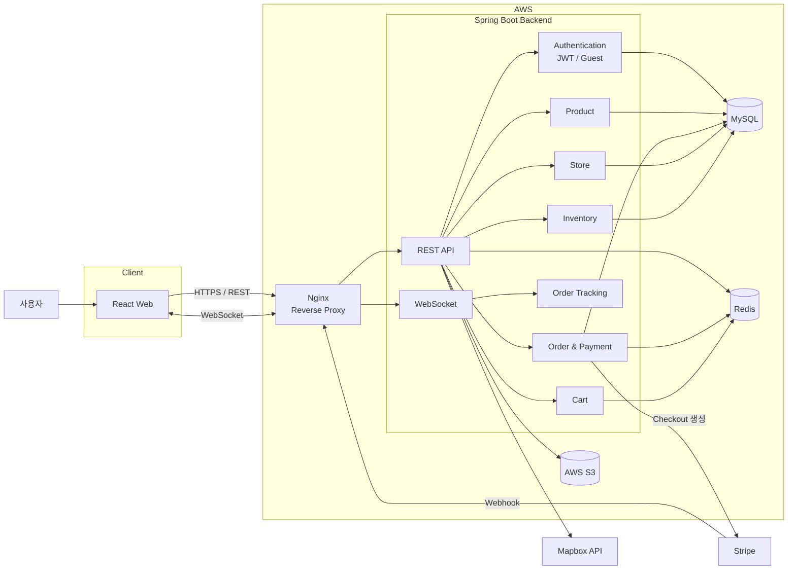
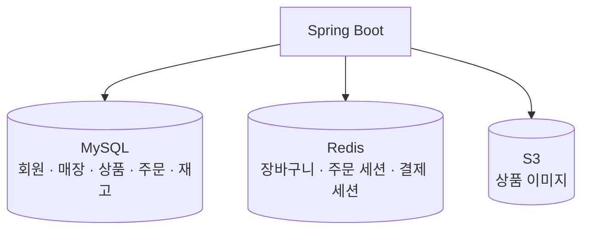

# 시스템 아키텍처
## 시스템 아키텍처

## 서비스 구조

```mermaid
flowchart LR
    USER[사용자]

    subgraph CLIENT[Client]
        WEB[React Web]
    end

    subgraph AWS[AWS]
        NGINX[Nginx<br/>Reverse Proxy]

        subgraph BACKEND[Spring Boot Backend]
            API[REST API]
            AUTH[Authentication<br/>JWT / Guest]
            PRODUCT[Product]
            ORDER[Order & Payment]
            INVENTORY[Inventory]
            STORE[Store]
            WEBSOCKET[WebSocket]
            ORDER_TRACKING[Order Tracking]
            CART[Cart]
        end

        MYSQL[(MySQL)]
        REDIS[(Redis)]
        S3[(AWS S3)]
    end

    STRIPE[Stripe]
    MAPBOX[Mapbox API]

    USER --> WEB
    WEB -->|HTTPS / REST| NGINX
    WEB <-->|WebSocket| NGINX

    NGINX --> API
    NGINX --> WEBSOCKET

    API --> AUTH
    API --> ORDER
    API --> PRODUCT
    API --> INVENTORY
    API --> STORE
    API --> CART

    WEBSOCKET --> ORDER_TRACKING

    AUTH --> MYSQL
    PRODUCT --> MYSQL
    ORDER --> MYSQL
    STORE --> MYSQL
    INVENTORY --> MYSQL

    API --> REDIS
    ORDER --> REDIS
    CART --> REDIS

    API --> S3
    API --> MAPBOX

    ORDER -->|Checkout 생성| STRIPE
    STRIPE -->|Webhook| NGINX
```

## 서비스 저장소

```mermaid
flowchart TB
    APP[Spring Boot]

    MYSQL[(MySQL<br/>회원 · 매장 · 상품 · 주문 · 재고)]
    REDIS[(Redis<br/>장바구니 · 주문 세션 · 결제 세션)]
    S3[(S3<br/>상품 이미지)]

    APP --> MYSQL
    APP --> REDIS
    APP --> S3
```