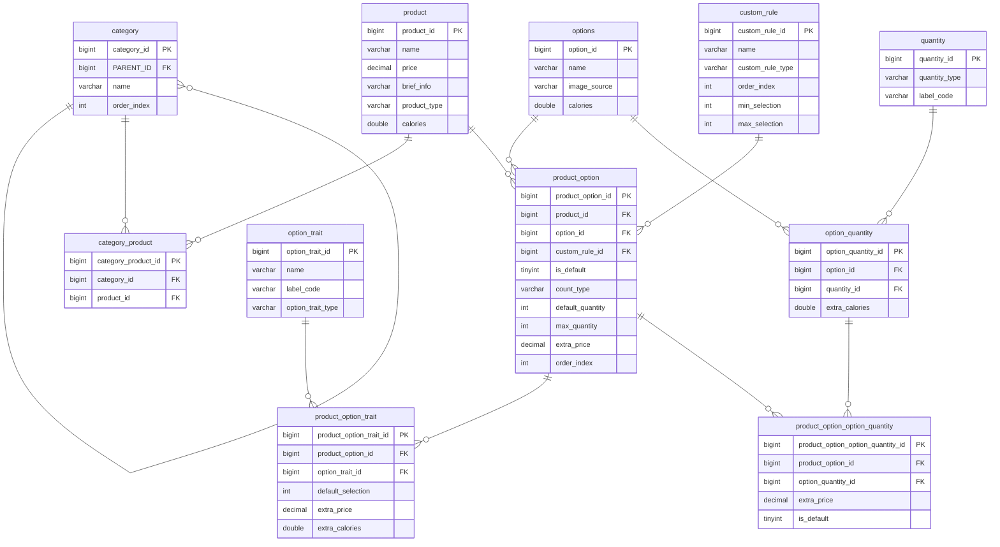
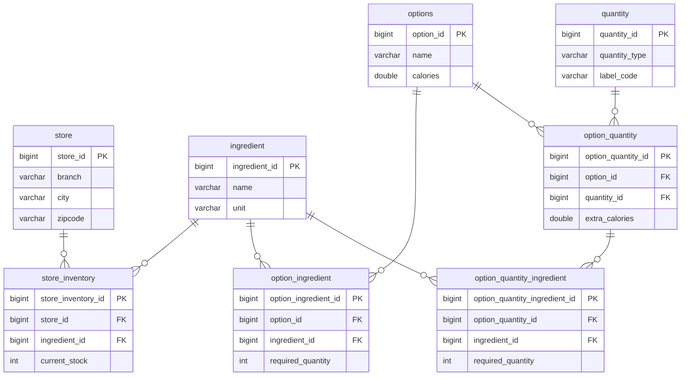

# 도메인 설계
## 1. 카탈로그

### ERD

### 주요 엔티티

| 엔티티 | 역할 |
| --- | --- |
| `product` | 치즈버거, 불고기버거와 같은  상품 |
| `option` | 치즈, 양상추, 피클과 같은 선택 가능한 재료 |
| `trait` | 토스팅, 맵기 정도 등과 같은 상세 선택 |
| `quantity` | 정수가 아닌 수량 (Small, Medium, Large) |
| `customRule` | 최소/최대 선택 개수 등 선택 규칙 |

#### 1. 상품별 옵션 구성

하나의 상품은 특정 옵션과 상세 옵션만 선택할 수 있어야 합니다.

e.g. 빅맥에는 치즈와 피클 옵션이 존재하지만 아메리카노에는 존재하지
않습니다.

이를 위해 `product`, `option`, `trait`, `quantity`를 분리하고 조인
엔티티를 통해 상품별로 허용된 옵션을 정의했습니다. 이러한 구조를 통해
상품마다 다른 옵션 구성을 가질 수 있으며, 잘못된 옵션 선택을 방지할 수
있습니다.

#### 2. 옵션 선택 규칙

옵션에 대해서는 선택 방식에 대한 제약이 필요합니다.

e.g. 버거 주문 시 "빵" 분류에서는 일반 빵, 브리오슈 빵, 없음 중 하나만
선택할 수 있지만, "토핑" 분류에서는 여러 옵션을 동시에 선택할 수
있습니다.

이를 위해 `customRule` 엔티티를 도입하여 아래와 같은 사항을 관리하도록
설계하여 규칙을 데이터를 통해 관리할 수 있도록 설계했습니다.

- 옵션 그룹 분류
- 최소 선택 개수
- 최대 선택 개수
- 화면 표시 순서

## 2. 상품 인벤토리

### ERD

### 주요 엔티티

| 엔티티 | 역할 |
| --- | --- |
| `store_inventory` | 매장별 재료 재고 |
| `ingredient` | 치즈, 패티, 빵 등 실제 차감 대상 재료 |
| `option` | 사용자가 선택하는 옵션 |
| `quantity` | 셀 수 없는 옵션에 대한 수량 선택 옵션 |
| `option_ingredient` | 셀 수 있는 옵션에 대한 재료량 |
| `option_quantity_ingredient` | 셀 수 없는 옵션에 대한 재료량 |

#### 재고 차감

패스트푸드는 상품의 재고를 옵션 단위로 관리합니다. 즉, 하나의 옵션이
여러 재료를 사용하는 관계입니다.

e.g. 치즈버거의 치즈 옵션은 "치즈"를 재고로 사용합니다.

따라서 재고는 `store_inventory`에서 매장별 `ingredient` 단위로 관리하고,
옵션 선택 시 셀 수 있는 수량에 대한 소모량은 `option_ingredient`, 셀 수
없는 수량에 대한 소모량은 `option_quantity_ingredient`로 분리하였습니다.

이를 통해 주문 시 선택된 옵션 조합을 기반으로 실제 차감해야 할 재료
재고를 계산할 수 있도록 설계하였습니다.

## 3. 주문

### 주요 엔티티

| 엔티티 | 역할 |
| --- | --- |
| `orders` | 주문 기본 정보, 결제 상태, 주문 상태 |
| `order_product` | 주문한 상품의 스냅샷 |
| `order_custom_rule` | 주문 당시 옵션 그룹/선택 규칙 스냅샷 |
| `order_product_option` | 주문 당시 선택한 옵션 스냅샷 |
| `order_product_option_trait` | 주문 당시 선택한 상세 옵션 스냅샷 |

#### 주문 스냅샷

주문은 결제와 정산의 기준이 되므로, 상품 카탈로그 변경의 영향을 받으면
안 됩니다.

따라서 `orders`에 `store_product_id` 같은 참조값만 저장하지 않고, 조인
엔티티를 활용하여 주문 당시의 상품명, 가격, 옵션명, 선택값을 함께
저장하였습니다. 이를 통해 상품 정보가 변경되거나 숨김 처리되더라도 과거
주문 내역은 결제 당시 기준으로 안정적으로 조회할 수 있습니다.

## ERD

---