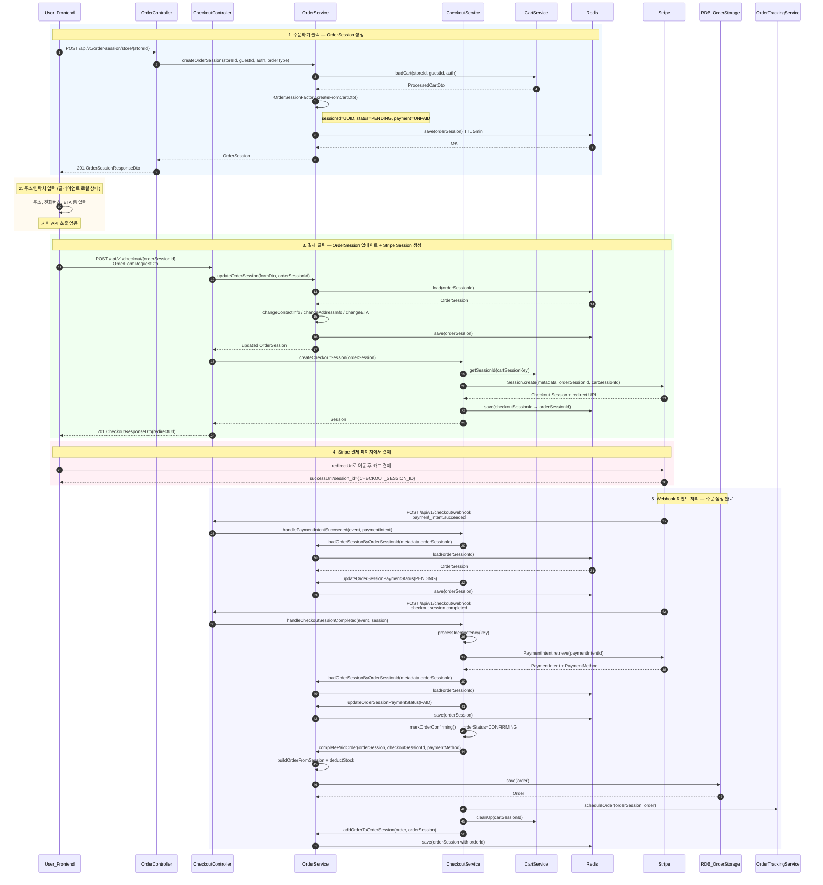
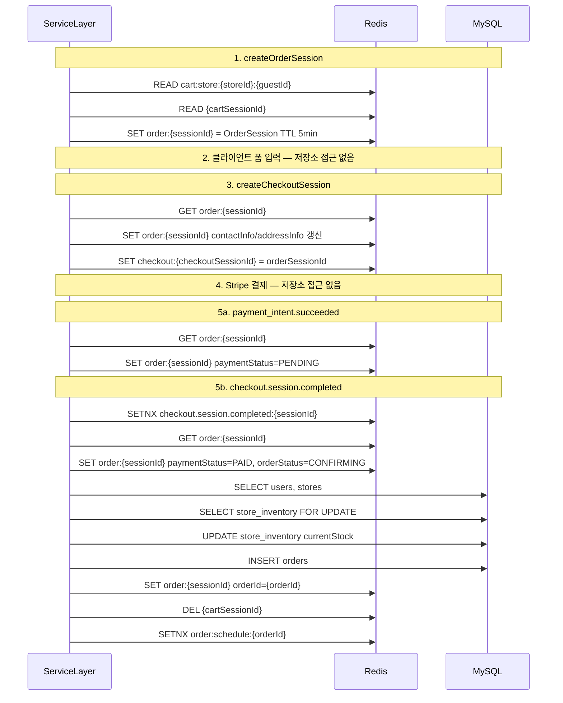
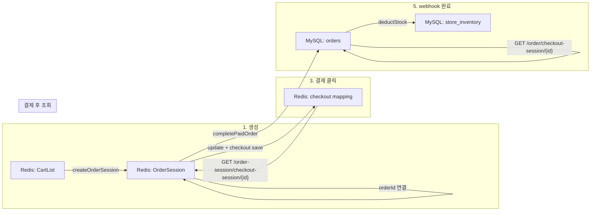
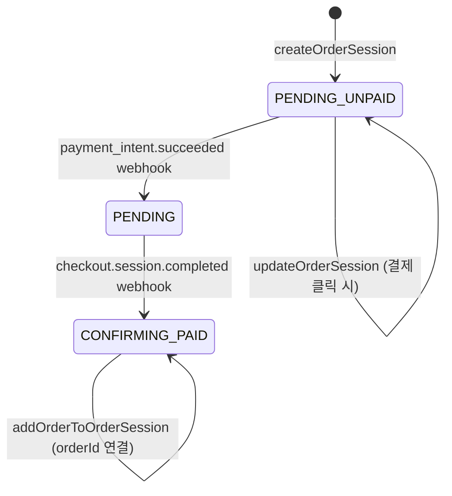

# OrderSession 흐름 Sequence Diagram

## 핵심 컴포넌트

| 컴포넌트 | 역할 |
|---|---|
| [OrderController](../src/main/java/com/whattheburger/backend/controller/OrderController.java) | `POST /api/v1/order-session/store/{storeId}` — OrderSession 생성 |
| [CheckoutController](../src/main/java/com/whattheburger/backend/controller/CheckoutController.java) | `POST /api/v1/checkout/{orderSessionId}` — 결제 시작, `POST /api/v1/checkout/webhook` — Stripe 이벤트 처리 |
| [OrderService](../src/main/java/com/whattheburger/backend/service/OrderService.java) | OrderSession CRUD, 주문 완료(`completePaidOrder`) |
| [CheckoutService](../src/main/java/com/whattheburger/backend/service/CheckoutService.java) | Stripe Checkout Session 생성, webhook 핸들링 |
| [RedisOrderSessionStorage](../src/main/java/com/whattheburger/backend/domain/order/RedisOrderSessionStorage.java) | OrderSession Redis 저장 (TTL 5분, key: `order:{sessionId}`) |
| [RedisCheckoutSessionStorage](../src/main/java/com/whattheburger/backend/repository/checkout/RedisCheckoutSessionStorage.java) | checkoutSessionId → orderSessionId 매핑 (key: `checkout:{checkoutSessionId}`) |

## 코드와 다른 점 (참고)

- **2단계(정보 입력)**: 별도 update API는 없습니다. 사용자가 프론트에서 주소/연락처를 입력하는 단계이며, **서버에 반영되는 시점은 3단계 `createCheckoutSession` 호출 시** [`OrderService.updateOrderSession()`](../src/main/java/com/whattheburger/backend/service/OrderService.java)에서 일괄 처리됩니다.
- **5단계 webhook 순서**: Stripe가 `payment_intent.succeeded`와 `checkout.session.completed`를 **각각 독립적으로** 보냅니다. 일반적으로 `payment_intent.succeeded`가 먼저 오고, 실제 **주문 생성은 `checkout.session.completed`에서** [`handleCheckoutSessionCompleted()`](../src/main/java/com/whattheburger/backend/service/CheckoutService.java)가 수행합니다.

---

## Sequence Diagram

---

## Redis / DB 상호작용

OrderSession 흐름에서 Redis와 MySQL이 언제, 어떤 key/table로 읽기/쓰기 되는지 정리합니다.

### Redis Key / DB Table 참조표

| 저장소 | Key / Table | 데이터 | TTL | 사용 시점 |
|---|---|---|---|---|
| Redis | `order:{sessionId}` | `OrderSession` 객체 | 5분 | 생성~결제 완료 전체 |
| Redis | `checkout:{checkoutSessionId}` | `orderSessionId` (String) | 없음 | 결제 클릭 시 저장, 결제 후 조회 |
| Redis | `cart:store:{storeId}:{guestId\|username}` | `cartSessionId` (String) | - | 장바구니 로드, 결제 완료 후 삭제 |
| Redis | `{cartSessionId}` | `CartList` 객체 | - | 장바구니 본문 |
| Redis | `{eventType}:{objectId}` | idempotency flag | 5분 | webhook 중복 처리 방지 |
| Redis | `order:schedule:{orderId}` | schedule idempotency flag | 5분 | 주문 상태 스케줄링 |
| MySQL | `orders` | `Order` 엔티티 INSERT | 영구 | `completePaidOrder` |
| MySQL | `store_inventory` | 재고 SELECT FOR UPDATE + UPDATE | 영구 | `deductStock` |
| MySQL | `users`, `stores` | User/Store SELECT | - | `buildOrderFromSession` |
| MySQL | `product_option`, `product_option_option_quantity` | SELECT | - | 재고 차감 계산 |

근거 코드:
- OrderSession Redis: [`RedisOrderSessionStorage`](../src/main/java/com/whattheburger/backend/domain/order/RedisOrderSessionStorage.java) — key `order:{sessionId}`, TTL 5분
- Checkout mapping: [`RedisCheckoutSessionStorage`](../src/main/java/com/whattheburger/backend/repository/checkout/RedisCheckoutSessionStorage.java) — key `checkout:{checkoutSessionId}`
- Idempotency: [`RedisWebhookIdempotencyStorage`](../src/main/java/com/whattheburger/backend/domain/checkout/RedisWebhookIdempotencyStorage.java)
- Order INSERT: [`RdbOrderStorage.save()`](../src/main/java/com/whattheburger/backend/domain/order/RdbOrderStorage.java) → `OrderRepository`
- Inventory UPDATE: [`InventoryService.deductStock()`](../src/main/java/com/whattheburger/backend/service/InventoryService.java) — `@Transactional`, pessimistic lock

### 저장소 중심 Sequence Diagram

### 데이터 생명주기

OrderSession은 Redis에 임시 저장되고, 결제 완료 시 Order가 MySQL에 영구 저장됩니다.

---

## OrderSession 상태 변화 요약

| 시점 | orderStatus | paymentStatus | 저장소 |
|---|---|---|---|
| 생성 | PENDING | UNPAID | Redis |
| 결제 클릭 (update) | PENDING | UNPAID | Redis (contactInfo/addressInfo 추가) |
| payment_intent.succeeded | PENDING | PENDING | Redis |
| checkout.session.completed | CONFIRMING | PAID | Redis + RDB(Order 생성) |

---

## 주요 API 엔드포인트

- `POST /api/v1/order-session/store/{storeId}` — OrderSession 생성
- `POST /api/v1/checkout/{orderSessionId}` — 정보 업데이트 + Stripe Checkout Session 생성
- `POST /api/v1/checkout/webhook` — Stripe webhook (`payment_intent.succeeded`, `checkout.session.completed`)
- `GET /api/v1/order-session/checkout-session/{sessionId}` — checkoutSessionId로 OrderSession 조회 (결제 후 확인용)
- `GET /api/v1/order/checkout-session/{sessionId}` — checkoutSessionId로 완료된 Order 조회
