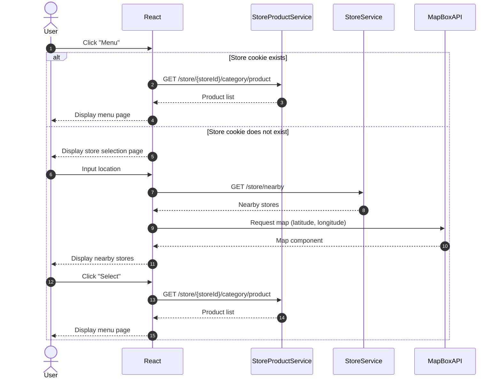
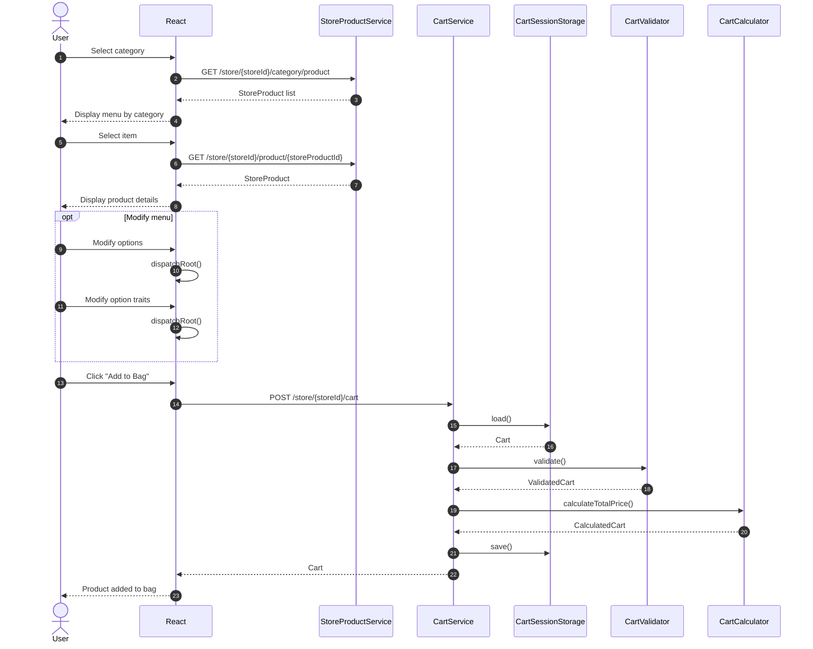
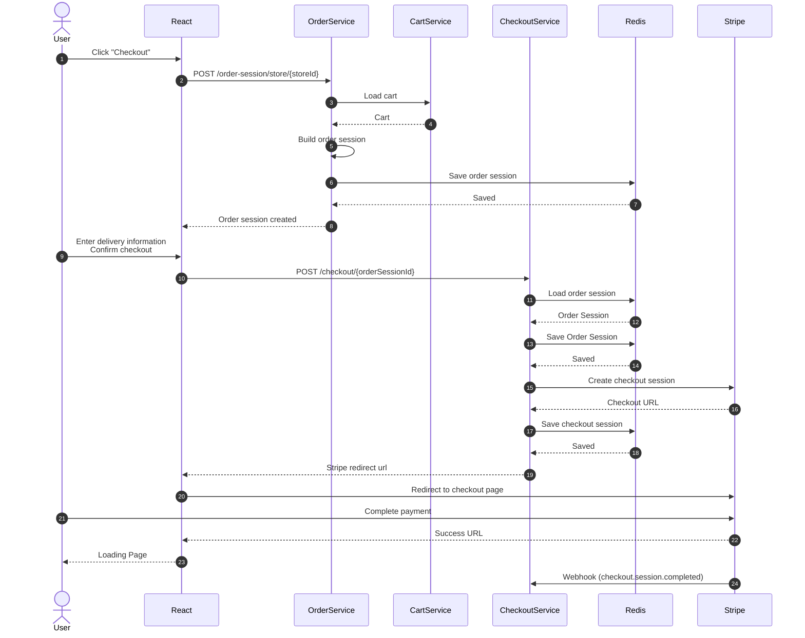
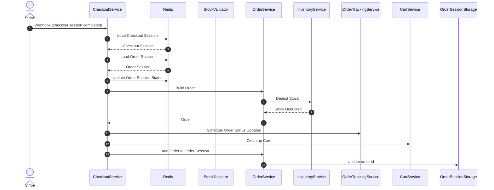
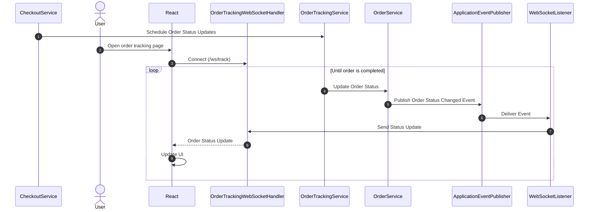

# 요청 흐름
## 1. 매장 불러오기

```mermaid
sequenceDiagram
    autonumber

    actor User
    participant React
    participant StoreProductService
    participant StoreService
    participant MapBoxAPI

    User->>React: Click "Menu"

    alt Store cookie exists
        React->>StoreProductService: GET /store/{storeId}/category/product
        StoreProductService-->>React: Product list
        React-->>User: Display menu page

    else Store cookie does not exist
        React-->>User: Display store selection page

        User->>React: Input location

        React->>StoreService: GET /store/nearby
        StoreService-->>React: Nearby stores

        React->>MapBoxAPI: Request map (latitude, longitude)
        MapBoxAPI-->>React: Map component

        React-->>User: Display nearby stores

        User->>React: Click "Select"

        React->>StoreProductService: GET /store/{storeId}/category/product
        StoreProductService-->>React: Product list

        React-->>User: Display menu page
    end
```
## 2. 장바구니 담기

```mermaid
sequenceDiagram

    actor User
    participant React
    participant StoreProductService
    participant CartService
    participant CartSessionStorage
    participant CartValidator
    participant CartCalculator
    autonumber

    User->>React: Select category
    React->>StoreProductService: GET /store/{storeId}/category/product
    StoreProductService-->>React: StoreProduct list
    React-->>User: Display menu by category

    User->>React: Select item
    React->>StoreProductService: GET /store/{storeId}/product/{storeProductId}
    StoreProductService-->>React: StoreProduct
    React-->>User: Display product details

    opt Modify menu
        User->>React: Modify options
        React->>React: dispatchRoot()

        User->>React: Modify option traits
        React->>React: dispatchRoot()
    end

    User->>React: Click "Add to Bag"

    React->>CartService: POST /store/{storeId}/cart

    CartService->>CartSessionStorage: load()
    CartSessionStorage-->>CartService: Cart


    CartService->>CartValidator: validate()
    CartValidator-->>CartService: ValidatedCart

    CartService->>CartCalculator: calculateTotalPrice()
    CartCalculator-->>CartService: CalculatedCart

    CartService->>CartSessionStorage: save()
    CartService-->>React: Cart
    React-->>User: Product added to bag
```

## 3. 주문 생성 및 결제 요청

```mermaid
sequenceDiagram

    actor User
    participant React
    participant OrderService
    participant CartService
    participant CheckoutService
    participant Redis
    participant Stripe
    autonumber

    User->>React: Click "Checkout"


    React->>OrderService: POST /order-session/store/{storeId}
    OrderService->>CartService: Load cart
    CartService-->>OrderService: Cart
    OrderService->>OrderService: Build order session
    OrderService->>Redis: Save order session
    Redis-->>OrderService: Saved
    OrderService-->>React: Order session created

    User->>React: Enter delivery information<br/>Confirm checkout
    React->>CheckoutService: POST /checkout/{orderSessionId}

    CheckoutService->>Redis: Load order session
    Redis-->>CheckoutService: Order Session

    CheckoutService->>Redis: Save Order Session
    Redis-->>CheckoutService: Saved
    CheckoutService->>Stripe: Create checkout session
    Stripe-->>CheckoutService: Checkout URL

    CheckoutService->>Redis: Save checkout session
    Redis-->>CheckoutService: Saved

    CheckoutService-->>React: Stripe redirect url

    React->>Stripe: Redirect to checkout page
    User->>Stripe: Complete payment

    Stripe-->>React: Success URL
    React-->>User: Loading Page
    Stripe->>CheckoutService: Webhook (checkout.session.completed)
```

## 4. 결제 처리

```mermaid
sequenceDiagram

    actor Stripe
    participant CheckoutService
    participant Redis
    participant StockValidator
    participant OrderService
    participant InventoryService
    participant OrderTrackingService
    participant CartService
    participant OrderSessionStorage
    autonumber

    Stripe->>CheckoutService: Webhook (checkout.session.completed)

    CheckoutService->>Redis: Load Checkout Session
    Redis-->>CheckoutService: Checkout Session

    CheckoutService->>Redis: Load Order Session
    Redis-->>CheckoutService: Order Session
    CheckoutService->>Redis: Update Order Session Status
    CheckoutService->>OrderService: Build Order
    OrderService->>InventoryService: Deduct Stock
    InventoryService-->>OrderService: Stock Deducted
    OrderService-->>CheckoutService: Order

    CheckoutService->>OrderTrackingService: Schedule Order Status Updates
    CheckoutService->>CartService: Clean up Cart
    CheckoutService->>OrderService: Add Order to Order Session
    OrderService->>OrderSessionStorage: Update order id
```
## 5. 실시간 주문 상태 조회

```mermaid
sequenceDiagram
    autonumber

    participant CheckoutService
    actor User
    participant React
    participant OrderTrackingWebSocketHandler
    participant OrderTrackingService
    participant OrderService
    participant ApplicationEventPublisher
    participant WebSocketListener

    CheckoutService->>OrderTrackingService: Schedule Order Status Updates

    User->>React: Open order tracking page
    React->>OrderTrackingWebSocketHandler: Connect (/ws/track)

    loop Until order is completed
        OrderTrackingService->>OrderService: Update Order Status
        OrderService->>ApplicationEventPublisher: Publish Order Status Changed Event
        ApplicationEventPublisher->>WebSocketListener: Deliver Event
        WebSocketListener->>OrderTrackingWebSocketHandler: Send Status Update
        OrderTrackingWebSocketHandler-->>React: Order Status Update
        React->>React: Update UI
    end
```